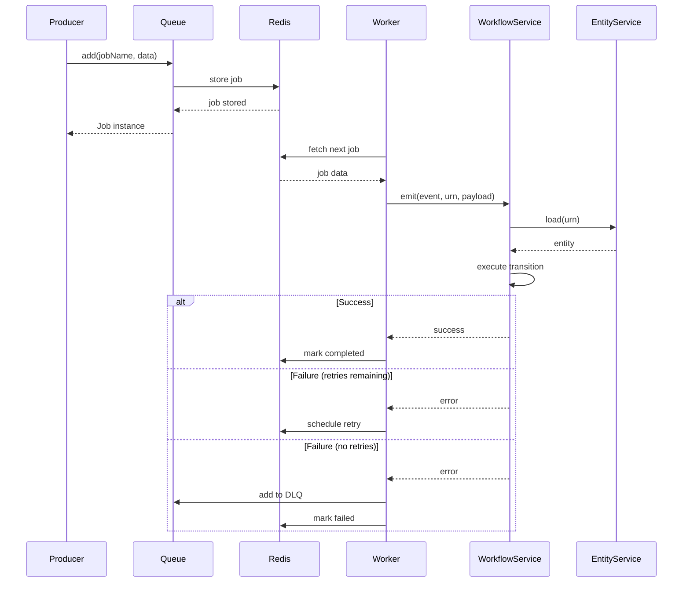

# Design Document

## Overview

The BullMQ Messaging Adapter extends the NestJS Workflow Library to support BullMQ as an alternative messaging backend. This design mirrors the existing Kafka integration architecture, providing a consistent developer experience while leveraging BullMQ's Redis-based queue system. The adapter is designed as a drop-in replacement for Kafka, allowing developers to choose their preferred messaging infrastructure without changing workflow logic.

The implementation follows the same patterns as KafkaClient, including retry logic, dead letter queues, health monitoring, and graceful shutdown. This consistency ensures that developers familiar with the Kafka integration can easily adopt BullMQ, and vice versa.

## Architecture

### High-Level Architecture

```mermaid
graph TB
    subgraph "Client Application"
        Controller[Controller/Service]
    end
    
    subgraph "Workflow Module"
        WM[WorkflowModule]
        WS[WorkflowService]
        ES[EntityService]
    end
    
    subgraph "Messaging Layer"
        BMC[BullMQClient]
        Queue[BullMQ Queue]
        Worker[BullMQ Worker]
        DLQ[Dead Letter Queue]
    end
    
    subgraph "Redis"
        Redis[(Redis Server)]
    end
    
    subgraph "Data Layer"
        Repo[Repository]
        DB[(Database)]
    end
    
    Controller -->|emit event| WS
    WM -->|registers| WS
    WM -->|provides| ES
    WM -->|provides| BMC
    WS -->|loads entity| ES
    WS -->|updates entity| ES
    ES -->|queries| Repo
    Repo -->|persists| DB
    WS -->|initializes workers| BMC
    BMC -->|manages| Queue
    BMC -->|manages| Worker
    BMC -->|manages| DLQ
    Queue -->|stores jobs| Redis
    Worker -->|processes jobs| Redis
    Worker -->|triggers| WS
    DLQ -->|stores failed jobs| Redis
```

### Design Principles

1. **Consistency with Kafka**: Mirror the KafkaClient API and patterns for familiarity
2. **BullMQ Native Features**: Leverage BullMQ's built-in retry, backoff, and job management
3. **Redis-Based**: Use Redis as the backing store for queues and job state
4. **Type Safety**: Maintain full TypeScript generics for job data and payloads
5. **Graceful Degradation**: Handle Redis connection failures gracefully
6. **Backward Compatibility**: Ensure existing Kafka workflows continue to work unchanged

## Components and Interfaces

### 1. BullMQEvent Interface

Defines the mapping between BullMQ queues and workflow events.

```typescript
interface BullMQEvent<Event> {
  queue: string;        // BullMQ queue name
  event: Event;         // Workflow event to emit
  jobName?: string;     // Optional job name for filtering
}
```

**Design Rationale:**
- Mirrors KafkaEvent structure for consistency
- Queue name maps to Kafka topic
- Optional jobName allows multiple event types per queue
- Simple one-to-one mapping between queue and workflow event

### 2. BullMQConfig Interface

Configuration for BullMQ connection and behavior.

```typescript
interface BullMQConfig {
  connection: {
    host: string;
    port: number;
    password?: string;
    db?: number;
    tls?: object;
  };
  events: BullMQEvent<any>[];
  defaultJobOptions?: {
    attempts?: number;        // Default: 3
    backoff?: {
      type: 'exponential' | 'fixed';
      delay: number;          // Default: 30000ms
    };
    removeOnComplete?: boolean | number;
    removeOnFail?: boolean | number;
  };
  deadLetterQueue?: {
    enabled: boolean;
    suffix?: string;          // Default: '-dlq'
  };
}
```

**Design Rationale:**
- Connection settings match Redis client configuration
- defaultJobOptions provide sensible defaults matching Kafka behavior
- Dead letter queue configuration is optional but recommended
- Removal policies prevent Redis memory bloat

### 3. WorkflowDefinition Extension

Extend the existing WorkflowDefinition to support BullMQ.

```typescript
interface WorkflowDefinition<T, P, Event, State> {
  // ... existing properties
  kafka?: {
    brokers: string;
    events: KafkaEvent<Event>[];
  };
  bullmq?: BullMQConfig;  // New property
}
```

**Design Rationale:**
- Optional property maintains backward compatibility
- Mutually exclusive with kafka (enforced at runtime)
- Same level as kafka in the configuration hierarchy

### 4. BullMQClient Class

The core client managing BullMQ operations.

```typescript
@Injectable()
export class BullMQClient implements OnModuleDestroy {
  private readonly logger = new Logger(BullMQClient.name);
  private readonly queues: Map<string, Queue> = new Map();
  private readonly workers: Map<string, Worker> = new Map();
  private readonly connection: ConnectionOptions;
  private readonly defaultJobOptions: JobsOptions;
  private readonly dlqConfig: { enabled: boolean; suffix: string };

  constructor(config: BullMQConfig)
  
  // Producer API
  async produce<T>(
    queueName: string,
    jobName: string,
    data: { urn: string; payload?: T }
  ): Promise<Job<T>>
  
  // Consumer API
  async consume<T>(
    queueName: string,
    handler: (job: Job<T>) => Promise<void>,
    options?: WorkerOptions
  ): Promise<Worker<T>>
  
  // Health and lifecycle
  async isHealthy(): Promise<boolean>
  async onModuleDestroy(): Promise<void>
  
  // Private helpers
  private getOrCreateQueue<T>(queueName: string): Queue<T>
  private async sendToDeadLetterQueue<T>(job: Job<T>, error: Error): Promise<void>
  private async closeWorker(worker: Worker): Promise<void>
  private async closeQueue(queue: Queue): Promise<void>
}
```

**Key Design Decisions:**

1. **Queue and Worker Management**: Maintain maps to reuse instances and enable proper cleanup
2. **Lazy Queue Creation**: Create queues on-demand when produce() is called
3. **Worker Lifecycle**: Workers are created explicitly via consume() and tracked for shutdown
4. **Connection Sharing**: All queues and workers share the same Redis connection configuration
5. **Job Data Structure**: Enforce `{ urn: string; payload?: T }` structure for consistency with Kafka

### 5. BullMQClient Implementation Details

#### Producer Implementation

```typescript
async produce<T>(
  queueName: string,
  jobName: string,
  data: { urn: string; payload?: T }
): Promise<Job<T>> {
  try {
    const queue = this.getOrCreateQueue<T>(queueName);
    
    const job = await queue.add(jobName, data, {
      ...this.defaultJobOptions,
      jobId: `${jobName}-${data.urn}-${Date.now()}`, // Unique job ID
    });
    
    this.logger.log(`Job added to queue`, queueName, job.id);
    return job;
  } catch (error) {
    this.logger.error(`Error adding job to queue: ${error.message}`, queueName);
    throw new Error(`Failed to add job to queue ${queueName}: ${error.message}`);
  }
}
```

**Design Rationale:**
- Unique job IDs prevent duplicate processing
- Default options can be overridden per job
- Error handling matches Kafka producer pattern
- Returns Job instance for tracking

#### Consumer Implementation

```typescript
async consume<T>(
  queueName: string,
  handler: (job: Job<T>) => Promise<void>,
  options?: WorkerOptions
): Promise<Worker<T>> {
  const worker = new Worker<T>(
    queueName,
    async (job: Job<T>) => {
      const urn = job.data.urn;
      this.logger.log(`Processing job`, job.id, queueName, urn);
      
      try {
        await handler(job);
        this.logger.log(`Job processed successfully`, job.id, queueName, urn);
      } catch (error) {
        this.logger.error(
          `Job processing failed: ${error.message}`,
          job.id,
          queueName,
          urn
        );
        
        // Check if this is the last attempt
        if (job.attemptsMade >= (job.opts.attempts || 3)) {
          this.logger.warn(`Job exceeded retry limit`, job.id, queueName, urn);
          
          if (this.dlqConfig.enabled) {
            await this.sendToDeadLetterQueue(job, error);
          }
        }
        
        throw error; // Re-throw to let BullMQ handle retry
      }
    },
    {
      connection: this.connection,
      ...this.defaultJobOptions,
      ...options,
    }
  );
  
  this.workers.set(queueName, worker);
  this.logger.log(`Worker initialized for queue`, queueName);
  
  return worker;
}
```

**Design Rationale:**
- BullMQ handles retry logic automatically
- Dead letter queue is triggered after final attempt
- Worker options can be customized per queue
- Error re-throwing allows BullMQ's retry mechanism to work
- Worker is tracked for graceful shutdown

#### Dead Letter Queue Implementation

```typescript
private async sendToDeadLetterQueue<T>(job: Job<T>, error: Error): Promise<void> {
  try {
    const dlqName = `${job.queueName}${this.dlqConfig.suffix}`;
    const dlqQueue = this.getOrCreateQueue(dlqName);
    
    await dlqQueue.add(
      `${job.name}-failed`,
      {
        originalJobId: job.id,
        originalJobName: job.name,
        originalData: job.data,
        error: {
          message: error.message,
          stack: error.stack,
        },
        failedAt: new Date().toISOString(),
        attemptsMade: job.attemptsMade,
      },
      {
        removeOnComplete: false, // Keep DLQ jobs for investigation
        removeOnFail: false,
      }
    );
    
    this.logger.warn(`Job sent to DLQ`, job.id, dlqName);
  } catch (dlqError) {
    this.logger.error(`Failed to send job to DLQ: ${dlqError.message}`, job.id);
  }
}
```

**Design Rationale:**
- DLQ jobs include full context for debugging
- DLQ jobs are never removed automatically
- DLQ failures are logged but don't block workflow
- Suffix is configurable (default: '-dlq')

### 6. WorkflowService Integration

Extend WorkflowService to initialize BullMQ workers.

```typescript
// In WorkflowService class
private bullmqClient?: BullMQClient;

async onModuleInit() {
  // ... existing initialization
  await this.initializeBullMQWorkers();
}

private async initializeBullMQWorkers() {
  if (!this.definition.bullmq) {
    this.logger.log('No BullMQ events defined.');
    return;
  }

  if (!this.bullmqClient) {
    this.logger.log('BullMQ client not available, skipping worker initialization.');
    return;
  }

  for (const bullmqDef of this.definition.bullmq.events) {
    await this.bullmqClient.consume(
      bullmqDef.queue,
      async (job: Job) => {
        const { urn, payload } = job.data;
        this.logger.log(
          `BullMQ job received on queue ${bullmqDef.queue}`,
          job.id,
          urn
        );
        
        try {
          await this.emit({ 
            event: bullmqDef.event, 
            urn, 
            payload 
          });
          this.logger.log(`BullMQ job processed successfully`, job.id, urn);
        } catch (error) {
          this.logger.error(
            `BullMQ job processing failed: ${error.message}`,
            job.id,
            urn
          );
          throw error; // Re-throw to trigger BullMQ retry
        }
      }
    );
    
    this.logger.log(`Initialized BullMQ worker for queue: ${bullmqDef.queue}`);
  }
}
```

**Design Rationale:**
- Mirrors initializeKafkaConsumers pattern exactly
- Job data structure matches Kafka message structure
- Error handling triggers BullMQ retry mechanism
- Logging follows same patterns as Kafka integration

### 7. WorkflowModule Extension

Update WorkflowModule to support BullMQ registration.

```typescript
static register<T, P, Event, State>(params: {
  name: string;
  definition: WorkflowDefinition<T, P, Event, State>;
  imports?: Array<Type<any> | DynamicModule | Promise<DynamicModule> | ForwardReference>;
  providers?: Provider[];
  kafka?: {
    enabled: boolean;
    clientId: string;
    brokers: string;
  };
  bullmq?: {
    enabled: boolean;
    config: BullMQConfig;
  };
}): DynamicModule {
  const providers = params.providers ?? [];

  // Validate mutually exclusive messaging backends
  if (params.kafka?.enabled && params.bullmq?.enabled) {
    throw new Error('Cannot enable both Kafka and BullMQ simultaneously');
  }

  // Register Kafka client if enabled
  if (params.kafka?.enabled) {
    providers.push({
      provide: KafkaClient,
      useFactory: () => new KafkaClient(params.kafka?.clientId, params.kafka?.brokers),
    });
  }

  // Register BullMQ client if enabled
  if (params.bullmq?.enabled) {
    providers.push({
      provide: BullMQClient,
      useFactory: () => new BullMQClient(params.bullmq!.config),
    });
  }

  // ... rest of existing module registration logic

  return {
    module: WorkflowModule,
    imports: [...(params.imports ?? [])],
    providers: [
      {
        provide: params.name,
        useFactory: (
          moduleRef: ModuleRef,
          kafkaClient?: KafkaClient,
          bullmqClient?: BullMQClient,
          entityService?: EntityService<T, State>
        ) => {
          const service = new WorkflowService(params.definition, entityService, moduleRef);
          
          if (kafkaClient) {
            (service as any).kafkaClient = kafkaClient;
          }
          
          if (bullmqClient) {
            (service as any).bullmqClient = bullmqClient;
          }
          
          return service;
        },
        inject: [
          ModuleRef,
          ...(params.kafka?.enabled ? [KafkaClient] : []),
          ...(params.bullmq?.enabled ? [BullMQClient] : []),
          ...(isEntityClass ? [{ token: params.definition.entity, optional: true }] : [])
        ],
      },
      // ... generic WorkflowService provider
      ...providers,
    ],
    exports: [
      params.name,
      WorkflowService,
      ...(params.kafka?.enabled ? [KafkaClient] : []),
      ...(params.bullmq?.enabled ? [BullMQClient] : []),
    ],
  };
}
```

**Design Rationale:**
- Validation ensures only one messaging backend is active
- Factory injection pattern matches Kafka implementation
- BullMQClient is exported for direct use if needed
- Conditional injection prevents unnecessary dependencies

## Data Models

### Job Data Structure

```typescript
interface WorkflowJobData<P = any> {
  urn: string;          // Required: Entity unique identifier
  payload?: P;          // Optional: Event payload
}
```

### Dead Letter Queue Job Data

```typescript
interface DLQJobData<P = any> {
  originalJobId: string;
  originalJobName: string;
  originalData: WorkflowJobData<P>;
  error: {
    message: string;
    stack?: string;
  };
  failedAt: string;
  attemptsMade: number;
}
```

### BullMQ Job Flow



## Error Handling

### Error Handling Strategy

1. **Job Processing Errors**: Caught by worker, trigger BullMQ retry
2. **Workflow Transition Errors**: Propagated to worker, trigger retry
3. **Redis Connection Errors**: Logged and reported via health check
4. **DLQ Errors**: Logged but don't block workflow processing
5. **Configuration Errors**: Thrown during module initialization

### Retry Configuration

```typescript
const defaultJobOptions: JobsOptions = {
  attempts: 3,
  backoff: {
    type: 'exponential',
    delay: 30000, // 30 seconds base delay
  },
  removeOnComplete: 1000, // Keep last 1000 completed jobs
  removeOnFail: 5000,     // Keep last 5000 failed jobs
};
```

**Retry Schedule:**
- Attempt 1: Immediate
- Attempt 2: 30 seconds delay
- Attempt 3: 60 seconds delay (exponential backoff)
- After 3 attempts: Move to DLQ

### Health Check Implementation

```typescript
async isHealthy(): Promise<boolean> {
  try {
    // Create a temporary connection to test Redis
    const testQueue = new Queue('health-check', {
      connection: this.connection,
    });
    
    await testQueue.client.ping();
    await testQueue.close();
    
    return true;
  } catch (error) {
    this.logger.error(`BullMQ health check failed: ${error.message}`);
    return false;
  }
}
```

## Testing Strategy

### Unit Testing Approach

1. **BullMQClient Tests**
   - Test queue creation and reuse
   - Test worker initialization
   - Test job production with correct data structure
   - Test dead letter queue functionality
   - Test health check with mocked Redis
   - Test graceful shutdown

2. **WorkflowService Integration Tests**
   - Test BullMQ worker initialization
   - Test job processing triggers workflow transitions
   - Test error handling and retry behavior
   - Test DLQ for failed jobs

3. **Module Registration Tests**
   - Test BullMQ client registration
   - Test mutual exclusivity with Kafka
   - Test provider injection
   - Test configuration validation

### Integration Testing with Redis

```typescript
describe('BullMQ Integration', () => {
  let redis: RedisMemoryServer;
  let bullmqClient: BullMQClient;
  
  beforeAll(async () => {
    redis = await RedisMemoryServer.create();
    const config: BullMQConfig = {
      connection: {
        host: await redis.getHost(),
        port: await redis.getPort(),
      },
      events: [],
      defaultJobOptions: { attempts: 3 },
      deadLetterQueue: { enabled: true },
    };
    bullmqClient = new BullMQClient(config);
  });
  
  afterAll(async () => {
    await bullmqClient.onModuleDestroy();
    await redis.stop();
  });
  
  it('should process jobs successfully', async () => {
    // Test implementation
  });
});
```

### Test Coverage Goals

- **Line Coverage**: > 90%
- **Branch Coverage**: > 85%
- **Function Coverage**: > 95%
- **Critical Paths**: 100% (job processing, retry logic, DLQ)

## Performance Considerations

### Optimization Strategies

1. **Connection Pooling**: Redis connections are shared across queues and workers
2. **Queue Reuse**: Queues are created once and reused for multiple jobs
3. **Worker Concurrency**: BullMQ workers can process multiple jobs concurrently
4. **Job Removal**: Completed and failed jobs are automatically removed to prevent memory bloat
5. **Lazy Queue Creation**: Queues are only created when first used

### Scalability Considerations

1. **Horizontal Scaling**: Multiple application instances can share the same queues
2. **Worker Distribution**: BullMQ automatically distributes jobs across workers
3. **Redis Clustering**: Supports Redis Cluster for high availability
4. **Job Prioritization**: BullMQ supports job priorities for critical workflows
5. **Rate Limiting**: Can configure rate limits per queue

### Performance Monitoring

Recommended metrics to track:
- Job processing time
- Queue depth
- Job failure rate
- Retry count distribution
- DLQ size
- Redis connection health
- Worker utilization

## Migration from Kafka to BullMQ

### Migration Steps

1. **Install BullMQ Dependencies**
```bash
npm install bullmq ioredis
```

2. **Update Workflow Definition**
```typescript
// Before (Kafka)
const definition: WorkflowDefinition = {
  // ... other config
  kafka: {
    brokers: 'localhost:9092',
    events: [
      { topic: 'order-events', event: OrderEvent.Created }
    ]
  }
};

// After (BullMQ)
const definition: WorkflowDefinition = {
  // ... other config
  bullmq: {
    connection: {
      host: 'localhost',
      port: 6379
    },
    events: [
      { queue: 'order-events', event: OrderEvent.Created }
    ],
    defaultJobOptions: {
      attempts: 3,
      backoff: { type: 'exponential', delay: 30000 }
    },
    deadLetterQueue: { enabled: true }
  }
};
```

3. **Update Module Registration**
```typescript
// Before (Kafka)
WorkflowModule.register({
  name: 'OrderWorkflow',
  definition,
  kafka: {
    enabled: true,
    clientId: 'order-service',
    brokers: 'localhost:9092'
  }
});

// After (BullMQ)
WorkflowModule.register({
  name: 'OrderWorkflow',
  definition,
  bullmq: {
    enabled: true,
    config: definition.bullmq!
  }
});
```

4. **Update Event Producers**
```typescript
// Before (Kafka)
await kafkaClient.produce('order-events', orderId, eventData);

// After (BullMQ)
await bullmqClient.produce('order-events', 'order-created', {
  urn: orderId,
  payload: eventData
});
```

### Comparison: Kafka vs BullMQ

| Feature | Kafka | BullMQ |
|---------|-------|--------|
| Infrastructure | Kafka + Zookeeper | Redis |
| Message Ordering | Partition-level | Queue-level |
| Retry Logic | Manual (pause/resume) | Built-in with backoff |
| Dead Letter Queue | Manual implementation | Built-in |
| Job Priorities | No | Yes |
| Delayed Jobs | No | Yes |
| Job Tracking | Manual | Built-in (job IDs) |
| Horizontal Scaling | Consumer groups | Multiple workers |
| Persistence | Disk-based | Redis persistence |
| Throughput | Very high | High |
| Latency | Low | Very low |
| Complexity | High | Low |

## Security Considerations

1. **Redis Authentication**: Support for password-protected Redis
2. **TLS/SSL**: Support for encrypted Redis connections
3. **Job Data Sanitization**: Validate job data before processing
4. **Error Message Sanitization**: Avoid leaking sensitive data in error logs
5. **Access Control**: Leverage Redis ACLs for queue-level permissions

## Deployment Considerations

1. **Redis Configuration**: Ensure Redis persistence is enabled (AOF or RDB)
2. **Redis Memory**: Monitor Redis memory usage and configure maxmemory policies
3. **Worker Scaling**: Scale workers based on queue depth
4. **Health Checks**: Expose BullMQ health check endpoint
5. **Graceful Shutdown**: Ensure workers complete in-flight jobs before shutdown
6. **Monitoring**: Use BullMQ Board or custom dashboards for queue monitoring

## Future Enhancements

1. **Job Priorities**: Support priority-based job processing
2. **Delayed Jobs**: Support scheduled workflow events
3. **Job Batching**: Process multiple jobs in a single workflow transition
4. **Queue Metrics**: Built-in Prometheus metrics for queues and workers
5. **Job Deduplication**: Prevent duplicate job processing
6. **Flow Support**: Use BullMQ Flows for complex job dependencies
7. **Rate Limiting**: Built-in rate limiting per queue
8. **Job Sandboxing**: Isolate job processing in separate processes
