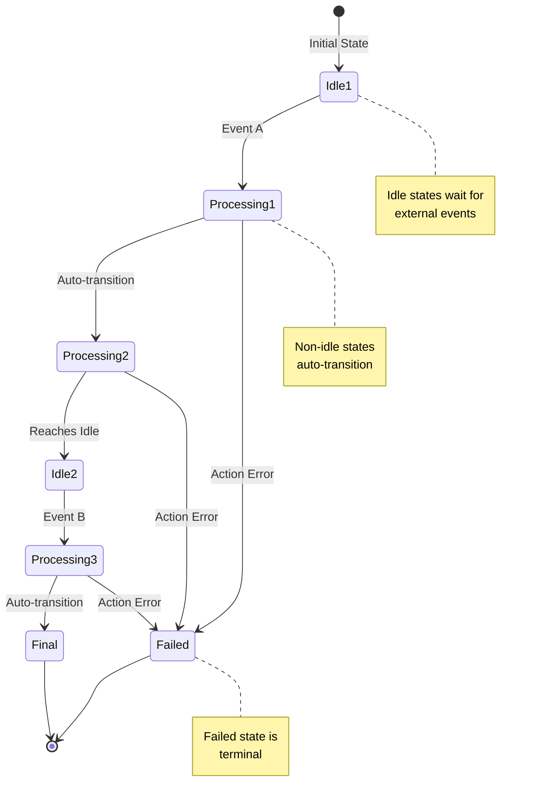
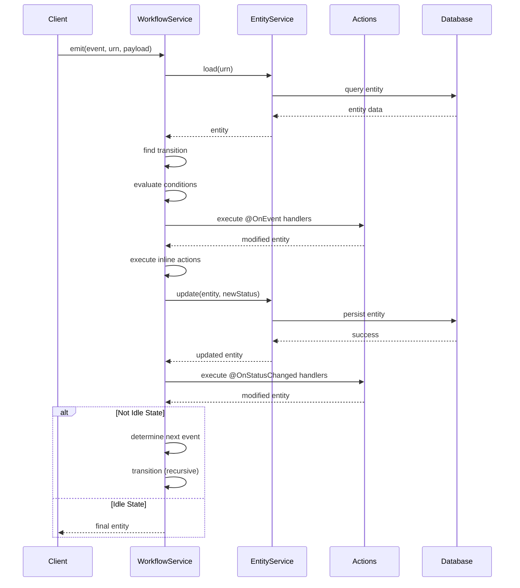
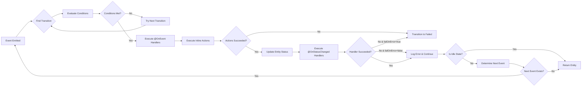

# Design Document

## Overview

The NestJS Workflow Library implements a stateless workflow engine using a domain-driven design approach. The architecture is built around the concept that workflow state belongs to domain entities, not to a separate state management system. This design eliminates the need for additional storage infrastructure and allows seamless integration with existing data layers.

The library provides two configuration paradigms: inline function-based definitions for simple workflows and decorator-based class definitions for complex workflows. Both approaches leverage NestJS's dependency injection system and module architecture for maximum flexibility and testability.

## Architecture

### High-Level Architecture

```mermaid
graph TB
    subgraph "Client Application"
        Controller[Controller/Service]
    end
    
    subgraph "Workflow Module"
        WM[WorkflowModule]
        WS[WorkflowService]
        ES[EntityService]
    end
    
    subgraph "Action System"
        AA[Action Classes]
        OnEvent[@OnEvent Handlers]
        OnStatus[@OnStatusChanged Handlers]
        Inline[Inline Actions]
    end
    
    subgraph "Kafka Integration"
        KC[KafkaClient]
        Consumer[Kafka Consumer]
        Producer[Kafka Producer]
    end
    
    subgraph "Data Layer"
        Repo[Repository]
        DB[(Database)]
    end
    
    Controller -->|emit event| WS
    WM -->|registers| WS
    WM -->|provides| ES
    WS -->|loads entity| ES
    WS -->|updates entity| ES
    ES -->|queries| Repo
    Repo -->|persists| DB
    WS -->|executes| OnEvent
    WS -->|executes| OnStatus
    WS -->|executes| Inline
    AA -->|contains| OnEvent
    AA -->|contains| OnStatus
    Consumer -->|triggers| WS
    WS -->|publishes| Producer
    KC -->|manages| Consumer
    KC -->|manages| Producer
```

### Core Design Principles

1. **Stateless Operation**: The workflow engine maintains no internal state; all state resides in domain entities
2. **Event-Driven**: State transitions are triggered by events, enabling reactive architectures
3. **Separation of Concerns**: Clear boundaries between workflow logic, entity management, and business actions
4. **Type Safety**: Full TypeScript generics ensure compile-time type checking
5. **Extensibility**: Multiple extension points through actions, conditions, and fallback mechanisms
6. **Integration-Friendly**: Designed to work with existing NestJS applications and data layers

## Components and Interfaces

### 1. WorkflowDefinition Interface

The central configuration object that defines all aspects of a workflow.

```typescript
interface WorkflowDefinition<T, P, Event, State> {
  name?: string;
  states: {
    finals: State[];      // Terminal states
    idles: State[];       // States waiting for external events
    failed: State;        // Error state
  };
  transitions: TransitionEvent<T, P, Event, State>[];
  actions?: Type<any>[];  // Decorator-based action classes
  conditions?: Type<any>[]; // Future: Decorator-based condition classes
  kafka?: {
    brokers: string;
    events: KafkaEvent<Event>[];
  };
  entity: EntityService<T, State> | EntityDefinition<T, State>;
  fallback?: (entity: T, event: Event, payload?: P) => Promise<T>;
}
```

**Design Rationale:**
- Separates state categories (finals, idles, failed) for clear workflow semantics
- Supports both class-based and inline entity configuration for flexibility
- Optional Kafka integration allows event-driven workflows without coupling
- Fallback mechanism provides graceful handling of unexpected transitions

### 2. TransitionEvent Interface

Defines individual state transitions with support for multiple sources and events.

```typescript
interface TransitionEvent<T, P, Event, States> {
  event: Event | Event[];           // Single or multiple triggering events
  from: States | States[];          // Single or multiple source states
  to: States;                       // Target state
  actions?: ((entity: T, payload?: P) => Promise<T>)[];
  conditions?: ((entity: T, payload?: P) => boolean)[];
}
```

**Design Rationale:**
- Arrays for `event` and `from` reduce duplication in workflow definitions
- Inline actions and conditions provide quick configuration for simple cases
- Separation of actions and conditions follows single responsibility principle
- All functions receive entity and payload for maximum flexibility

### 3. WorkflowService Class

The core orchestration engine that executes workflow transitions.

```typescript
class WorkflowService<T, P, E, S> implements Workflow<T, E>, OnModuleInit {
  // Public API
  async emit(params: { event: E; urn: string; payload?: P }): Promise<T>
  async onModuleInit(): Promise<void>
  
  // Private orchestration methods
  private async transition(params): Promise<T>
  private async executeInlineActions(...): Promise<{failed, Element, message}>
  private nextEvent(entity: T): E | null
  private isInIdleStatus(entity: T): boolean
  private isInFailedStatus(entity: T): boolean
  
  // Configuration methods
  private configureActions(): void
  private configureConditions(): void
  private async initializeKafkaConsumers(): Promise<void>
  
  // Entity operations
  private async loadEntity(urn: string): Promise<T | null>
  private getEntityStatus(entity: T): S
  private async updateEntityStatus(entity: T, status: S): Promise<T>
  private getEntityUrn(entity: T): string
}
```

**Key Design Decisions:**

1. **Generic Type Parameters**: `<T, P, E, S>` ensure type safety across entity, payload, event, and state
2. **Single Entry Point**: `emit()` method provides a simple, consistent API
3. **Auto-Transition Loop**: The `transition()` method continues executing until reaching an idle or final state
4. **Lazy Entity Resolution**: EntityService can be resolved from ModuleRef during initialization or runtime
5. **Metadata-Based Action Discovery**: Uses Reflect API to discover decorated methods at initialization

### 4. EntityService Abstract Class

Defines the contract for entity lifecycle management.

```typescript
abstract class EntityService<T, State> {
  abstract new(): Promise<T>
  abstract update(entity: T, status: State): Promise<T>
  abstract load(urn: string): Promise<T | null>
  abstract status(entity: T): State
  abstract urn(entity: T): string
}
```

**Design Rationale:**
- Abstract class allows dependency injection of concrete implementations
- Separates entity operations from workflow logic
- Enables integration with any data layer (TypeORM, Mongoose, Prisma, etc.)
- All methods are async-compatible for database operations

### 5. WorkflowModule Dynamic Module

Provides NestJS module registration with dependency injection setup.

```typescript
class WorkflowModule {
  static register<T, P, Event, State>(params: {
    name: string;
    definition: WorkflowDefinition<T, P, Event, State>;
    imports?: Array<Type<any> | DynamicModule>;
    providers?: Provider[];
    kafka?: {
      enabled: boolean;
      clientId: string;
      brokers: string;
    };
  }): DynamicModule
}
```

**Design Rationale:**
- Dynamic module pattern allows multiple workflow registrations in one application
- Named provider (`params.name`) enables injection of specific workflows
- Generic WorkflowService provider allows injection by type
- Automatic EntityService registration when provided as a class
- Conditional KafkaClient registration based on configuration

### 6. Decorator System

Three decorators provide metadata-driven action configuration.

```typescript
// Class decorator
@WorkflowAction()
class MyActions { }

// Method decorators
@OnEvent({ event: MyEvent.Submit, order?: number })
async handleEvent(params: { entity: T; payload?: P }): Promise<T>

@OnStatusChanged({ from: State.A, to: State.B, failOnError?: boolean })
async handleStatusChange(params: { entity: T; payload?: P }): Promise<T>
```

**Design Rationale:**
- Decorators use Reflect metadata API for runtime discovery
- Standardized parameter structure `{ entity, payload }` enforced by validation
- Order property on @OnEvent enables deterministic execution sequence
- failOnError flag on @OnStatusChanged provides granular error handling control

### 7. KafkaClient

Manages Kafka producer and consumer operations with retry logic.

```typescript
class KafkaClient {
  async produce<T>(topic: string, key: string, event: T): Promise<void>
  async consume<T>(topic: string, groupId: string, handler: IEventHandler<T>): Promise<void>
  async isHealthy(): Promise<boolean>
}
```

**Design Features:**
- Automatic retry with configurable limits (default: 3 retries)
- Dead letter queue for failed messages
- Pause/resume mechanism for retry delays (default: 30 seconds)
- Health check for monitoring Kafka connectivity
- Offset management with manual resolution for reliability

## Data Models

### Workflow State Machine Model



### Transition Execution Flow



### Action Execution Order



## Error Handling

### Error Handling Strategy

The workflow engine implements a multi-layered error handling approach:

1. **Inline Action Errors**: Caught and trigger immediate transition to failed state
2. **@OnEvent Handler Errors**: Caught and trigger transition to failed state
3. **@OnStatusChanged Handler Errors**: Configurable behavior via `failOnError` flag
4. **Entity Load Errors**: Propagated to caller with context
5. **Transition Not Found Errors**: Throw descriptive error or invoke fallback function
6. **Kafka Consumer Errors**: Retry with exponential backoff, then dead letter queue

### Failed State Transition

```typescript
// When any action fails
try {
  entity = await action(entity, payload);
} catch (error) {
  logger.error(`Action failed: ${error.message}`, urn);
  entity = await updateEntityStatus(entity, definition.states.failed);
  break; // Exit transition loop
}
```

### Fallback Mechanism

```typescript
// When no valid transition is found
if (!transition && definition.fallback) {
  logger.log(`Falling back to default transition`, urn);
  entity = await definition.fallback(entity, event, payload);
  return entity;
}
```

### Kafka Retry Logic

```typescript
// Retry with pause/resume
if (retries < RETRY_LIMIT) {
  retryCounts.set(offsetKey, retries + 1);
  consumer.pause([{ topic, partitions: [partition] }]);
  setTimeout(() => {
    consumer.resume([{ topic, partitions: [partition] }]);
  }, RETRY_DELAY_MS);
} else {
  // Send to dead letter queue
  await sendToDeadLetterQueue(message);
  retryCounts.delete(offsetKey);
}
```

## Testing Strategy

### Unit Testing Approach

1. **WorkflowService Tests**
   - Test transition logic with mock entities
   - Verify condition evaluation
   - Test auto-transition behavior
   - Verify error handling and failed state transitions

2. **Decorator Tests**
   - Test @OnEvent handler discovery and execution
   - Test @OnStatusChanged handler discovery and execution
   - Test execution order with multiple handlers
   - Test failOnError behavior

3. **EntityService Tests**
   - Test entity loading and updating
   - Test integration with repositories
   - Test error handling for missing entities

4. **Module Tests**
   - Test dynamic module registration
   - Test provider creation and injection
   - Test EntityService resolution from ModuleRef

### Integration Testing Approach

1. **End-to-End Workflow Tests**
   - Test complete workflow execution from start to finish
   - Test multiple paths through the workflow
   - Test error scenarios and recovery

2. **Kafka Integration Tests**
   - Test Kafka consumer initialization
   - Test event mapping from Kafka topics to workflow events
   - Test retry logic and dead letter queue

3. **NestJS Module Integration Tests**
   - Test workflow registration in NestJS application
   - Test dependency injection of workflows and services
   - Test multiple workflows in single application

### Test Utilities

```typescript
// Mock ModuleRef for testing
const moduleRef = createMock<ModuleRef>();

// Create test workflow service
const workflow = new WorkflowService(definition, moduleRef);

// Mock entity service
const mockEntityService = {
  load: jest.fn().mockResolvedValue(testEntity),
  update: jest.fn().mockImplementation((e, s) => { e.status = s; return e; }),
  status: jest.fn().mockImplementation(e => e.status),
  urn: jest.fn().mockImplementation(e => e.id),
  new: jest.fn().mockResolvedValue(new TestEntity())
};
```

### Test Coverage Goals

- **Line Coverage**: > 90%
- **Branch Coverage**: > 85%
- **Function Coverage**: > 95%
- **Critical Paths**: 100% (transition logic, error handling, auto-transitions)

## Performance Considerations

### Optimization Strategies

1. **Entity Loading**: Entities are loaded once per `emit()` call and reused throughout auto-transitions
2. **Metadata Caching**: Decorator metadata is discovered once during `onModuleInit()` and cached
3. **Transition Lookup**: Transitions are stored in arrays for O(n) lookup; acceptable for typical workflow sizes
4. **Condition Evaluation**: Short-circuit evaluation stops at first failing condition
5. **Kafka Consumer**: Batch processing with manual offset resolution for reliability

### Scalability Considerations

1. **Horizontal Scaling**: Stateless design allows multiple instances without coordination
2. **Kafka Consumer Groups**: Multiple instances can share Kafka topic consumption
3. **Database Connection Pooling**: EntityService implementations should use connection pooling
4. **Memory Footprint**: Minimal memory usage as no state is cached between requests

### Performance Monitoring

Recommended metrics to track:
- Transition execution time
- Entity load time
- Action execution time
- Kafka message processing time
- Failed state transition rate
- Retry count distribution

## Security Considerations

1. **Input Validation**: Payloads should be validated before passing to actions
2. **Entity Authorization**: EntityService implementations should enforce access control
3. **Kafka Security**: Support for SASL/SSL authentication in Kafka configuration
4. **Error Messages**: Avoid leaking sensitive information in error logs
5. **Dependency Injection**: Leverage NestJS guards and interceptors for cross-cutting security concerns

## Deployment Considerations

1. **Environment Configuration**: Kafka brokers, client IDs, and retry limits should be configurable
2. **Logging Levels**: Adjustable log levels for production vs development
3. **Health Checks**: Kafka health check endpoint for monitoring
4. **Graceful Shutdown**: Kafka consumers should disconnect cleanly on application shutdown
5. **Database Migrations**: EntityService implementations must handle schema changes

## Future Enhancements

1. **Decorator-Based Conditions**: Support `@Condition` decorator similar to actions
2. **Workflow Visualization**: Generate Mermaid diagrams from WorkflowDefinition
3. **Workflow Versioning**: Support multiple versions of same workflow
4. **Saga Pattern**: Built-in support for compensating transactions
5. **Workflow Composition**: Ability to nest workflows or call sub-workflows
6. **Event Sourcing**: Optional event log for workflow execution history
7. **Metrics Integration**: Built-in Prometheus metrics
8. **GraphQL Subscriptions**: Real-time workflow status updates
